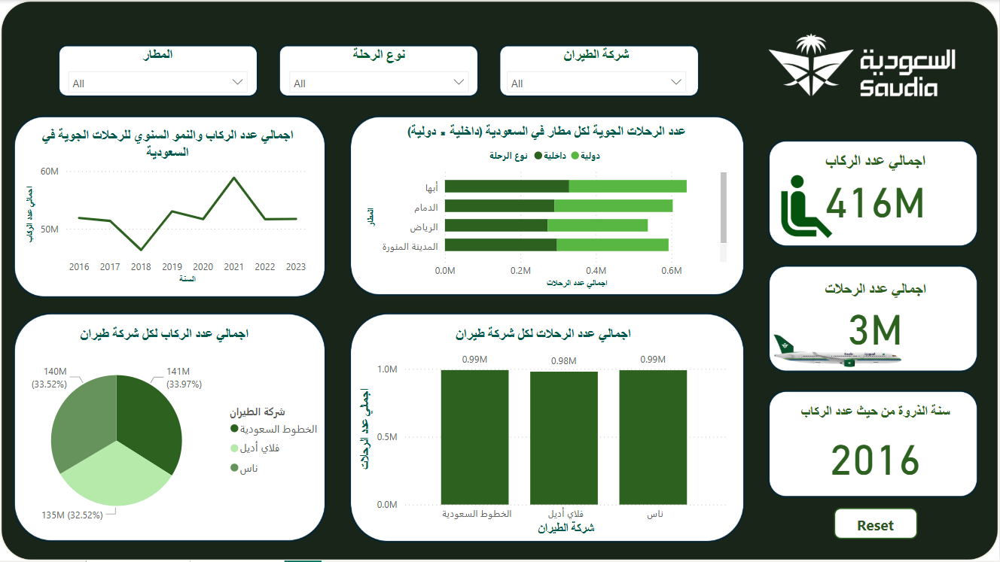

# Saudi Airlines Power BI Dashboard

This project showcases an interactive Power BI dashboard analyzing air travel data in the Kingdom of Saudi Arabia. It highlights trends in passenger numbers, flight volume, airline performance, and airport usage over several years.

---

## Dashboard Overview

**Main Features:**
- Annual passenger volume trends (2016–2023)
- Flight counts by airport and flight type (Domestic vs. International)
- Passenger distribution by airline (Saudia, Flynas, Flyadeal)
- Flight distribution by airline
- Filters by airport, airline, and flight type
- Reset button for default dashboard state

---

## Dataset Description

The dataset includes the following fields:
- Airline name
- Domestic and international passenger counts
- Total passenger count
- Number of flights
- Flight type
- Airport name
- Year of operation

---

## Data Preparation & Processing

**Steps performed:**
1. Cleaned raw data in Excel (null values, types)
2. Created calculated columns (e.g., total passengers, share per airline)
3. Conducted time-series trend analysis
4. Built interactive visualizations in Power BI:
   - Line chart for passenger trends
   - Bar charts and pie charts for airline/airport stats
   - Card visuals for key figures (total passengers, flights, peak year)
   - Slicers + reset button for interactivity

---

## Repository Contents

| File | Description |
|------|-------------|
| `pic1.png` | Dashboard screenshot |
| `تقرير_تحليل_الرحلات_الجوية.pdf` | Full project report (Arabic) |
| `تحليل بيانات الخطوط الجوية السعودية.xlsx` | Cleaned data and transformation steps |

---

## Key Findings

- Over **416 million passengers** traveled during the analysis period
- Around **3 million flights** were executed
- **2016** had the lowest passenger traffic (potential for improvement)
- Passenger load was nearly equally distributed across **Saudia, Flynas, and Flyadeal**
- 🇸🇦 Domestic and international flights were roughly **50/50**

---

## Recommendations

- Improve airline coordination to avoid over-saturation
- Expand infrastructure at high-traffic airports (e.g., Riyadh, Jeddah)
- Use predictive analytics to optimize seasonal capacity
- Enhance operational efficiency in years with low passenger volume

---

## Note

This project was developed for academic and analytical demonstration purposes. It does not represent any official position of Saudia or associated government entities.
